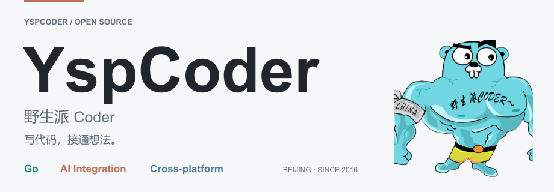
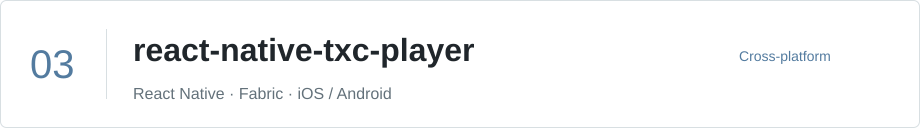

<picture>
  <source media="(prefers-color-scheme: dark) and (max-width: 640px)" srcset="assets/modern-banner-dark-mobile.png">
  <source media="(max-width: 640px)" srcset="assets/modern-banner-light-mobile.png">
  <source media="(prefers-color-scheme: dark)" srcset="assets/modern-banner-dark.png">
  
</picture>

   
  <strong>写代码，接通想法。</strong> 
  在北京，用 Go 构建服务与 SDK，探索 AI 集成、自动化与跨平台交互。

  <a href="#精选项目">精选项目</a> ·
  <a href="#技术方向">技术方向</a> ·
  <a href="#开源足迹">开源足迹</a> ·
  <a href="https://github.com/YspCoder?tab=repositories">全部仓库</a>

## 精选项目

<a href="https://github.com/YspCoder/social-hub">
  <picture>
    <source media="(prefers-color-scheme: dark) and (max-width: 640px)" srcset="assets/modern-project-social-hub-dark-mobile.svg">
    <source media="(max-width: 640px)" srcset="assets/modern-project-social-hub-light-mobile.svg">
    <source media="(prefers-color-scheme: dark)" srcset="assets/modern-project-social-hub-dark.svg">
    
  </picture>
</a>

**统一社交平台 SDK 与自托管 MCP。** 让应用与 Agent 共用集成能力。[中文文档 →](https://github.com/YspCoder/social-hub/blob/main/README.zh-CN.md)

<a href="https://github.com/YspCoder/omnigo">
  <picture>
    <source media="(prefers-color-scheme: dark) and (max-width: 640px)" srcset="assets/modern-project-omnigo-dark-mobile.svg">
    <source media="(max-width: 640px)" srcset="assets/modern-project-omnigo-light-mobile.svg">
    <source media="(prefers-color-scheme: dark)" srcset="assets/modern-project-omnigo-dark.svg">
    
  </picture>
</a>

**Go 的统一模型集成工具包。** 连接文本、工具调用、图像与视频。[使用示例 →](https://github.com/YspCoder/omnigo#快速开始)

<a href="https://github.com/YspCoder/react-native-txc-player">
  <picture>
    <source media="(prefers-color-scheme: dark) and (max-width: 640px)" srcset="assets/modern-project-react-native-txc-player-dark-mobile.svg">
    <source media="(max-width: 640px)" srcset="assets/modern-project-react-native-txc-player-light-mobile.svg">
    <source media="(prefers-color-scheme: dark)" srcset="assets/modern-project-react-native-txc-player-dark.svg">
    
  </picture>
</a>

**把原生点播能力带进 React Native。** 基于腾讯云 LiteAV 与 Fabric，支持 iOS 和 Android。[接入文档 →](https://github.com/YspCoder/react-native-txc-player#usage)

<a href="https://github.com/YspCoder/PixelAdventure2D-UE5">
  <picture>
    <source media="(prefers-color-scheme: dark) and (max-width: 640px)" srcset="assets/modern-project-pixel-adventure-dark-mobile.svg">
    <source media="(max-width: 640px)" srcset="assets/modern-project-pixel-adventure-light-mobile.svg">
    <source media="(prefers-color-scheme: dark)" srcset="assets/modern-project-pixel-adventure-dark.svg">
    
  </picture>
</a>

**用蓝图探索 2D 像素游戏。** UE 5.2 游戏模板，包含 16 个关卡与移动触控支持。[项目仓库 →](https://github.com/YspCoder/PixelAdventure2D-UE5)

## 技术方向

`Go` · `Python` · `TypeScript` · `React Native` · `Kotlin` · `Unreal Engine` · `MCP`

- **构建**：Go SDK、API 集成与模型服务适配。
- **自动化**：Python、浏览器操作与 Agent Skills。
- **交互**：React Native 原生桥接、Unreal Engine 蓝图与 2D 游戏。

也在整理 [gemini-image-proxy](https://github.com/YspCoder/gemini-image-proxy) 与 [clawgo-skills](https://github.com/YspCoder/clawgo-skills)，让重复的工作更容易交给工具。

## 开源足迹

<picture>
  <source media="(prefers-color-scheme: dark) and (max-width: 640px)" srcset="assets/stats-mobile-dark.svg">
  <source media="(max-width: 640px)" srcset="assets/stats-mobile-light.svg">
  <source media="(prefers-color-scheme: dark)" srcset="assets/stats-dark.svg">
  
</picture>

---

  欢迎在项目里交流想法、提交 Issue，或一起完善工具。 
  <a href="https://github.com/YspCoder?tab=repositories"><strong>找到你感兴趣的项目 →</strong></a>

