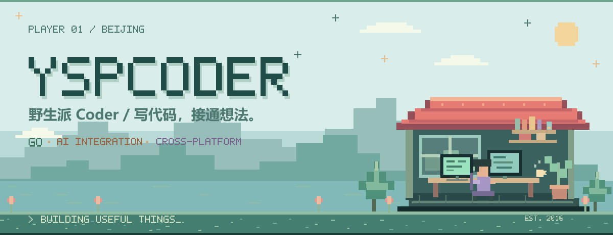

<picture>
  <source media="(prefers-color-scheme: dark) and (max-width: 640px)" srcset="assets/banner-dark-mobile.png">
  <source media="(max-width: 640px)" srcset="assets/banner-light-mobile.png">
  <source media="(prefers-color-scheme: dark)" srcset="assets/banner-dark.png">
  
</picture>

   
  <strong>你好，我是野生派 Coder。</strong> 
  在北京，用 Go 构建服务与 SDK，探索 AI、跨平台交互和像素游戏。 
  把想法写成代码，把重复的工作交给工具。

  <a href="#精选项目">精选项目</a> ·
  <a href="#技术与探索">技术与探索</a> ·
  <a href="https://github.com/YspCoder?tab=repositories">全部仓库</a>

## 精选项目

### 01 / [social-hub](https://github.com/YspCoder/social-hub)

**用一套 Go 接口连接不同的社交平台。**

面向全球及国内社交 API 的统一 SDK，提供自托管 MCP 服务，让应用与 Agent 共用发布、读取、媒体和消息等集成能力。

`Go` · `MCP` · `API Integration` · Alpha

[阅读中文文档 →](https://github.com/YspCoder/social-hub/blob/main/README.zh-CN.md)

---

### 02 / [omnigo](https://github.com/YspCoder/omnigo)

**把多家模型服务接入同一套调用方式。**

面向 Go 的 LLM 集成工具包。通过 adapter / relay 统一模型调用，支持流式输出、结构化输出、工具调用，以及图像、视频等多媒体任务。

`Go` · `LLM` · `Multimodal` · 持续迭代

[查看使用示例 →](https://github.com/YspCoder/omnigo#快速开始)

---

### 03 / [react-native-txc-player](https://github.com/YspCoder/react-native-txc-player)

**把原生点播能力带进 React Native。**

基于 Fabric 封装腾讯云 LiteAV 点播播放器，面向 iOS 与 Android 提供播放控制、事件监听、预下载和组件卸载时的资源释放。

`React Native` · `TypeScript` · `Kotlin` · `Objective-C++`

[查看接入文档 →](https://github.com/YspCoder/react-native-txc-player#usage)

---

### 04 / [PixelAdventure2D-UE5](https://github.com/YspCoder/PixelAdventure2D-UE5)

**用蓝图探索 2D 像素游戏。**

基于 Unreal Engine 5.2、Blueprints 与 PaperZD 的游戏模板探索，包含 16 个关卡和移动触控支持。

`Unreal Engine` · `Blueprints` · `PaperZD` · 游戏模板

[进入像素世界 →](https://github.com/YspCoder/PixelAdventure2D-UE5)

## 技术与探索

  
  
  
  
  
  
  

- **Go / 服务集成**：SDK、能力接口、模型服务适配与可复用的基础组件。
- **Python / 自动化**：图像生成脚本、浏览器操作与 Agent Skills。
- **跨平台 / 交互**：React Native 原生桥接，以及 Unreal Engine 蓝图与 2D 游戏模板探索。

也在整理 [gemini-image-proxy](https://github.com/YspCoder/gemini-image-proxy) 与 [clawgo-skills](https://github.com/YspCoder/clawgo-skills)，让重复的工作更容易交给工具。

## 开源足迹

<picture>
  <source media="(prefers-color-scheme: dark) and (max-width: 640px)" srcset="assets/stats-mobile-dark.svg">
  <source media="(max-width: 640px)" srcset="assets/stats-mobile-light.svg">
  <source media="(prefers-color-scheme: dark)" srcset="assets/stats-dark.svg">
  
</picture>

---

  欢迎在项目里交流想法、提交 Issue，或一起完善工具。 
  <a href="https://github.com/YspCoder?tab=repositories"><strong>找到你感兴趣的项目 →</strong></a>

<picture>
  <source media="(max-width: 640px)" srcset="assets/pixel-footer-mobile.svg">
  
</picture>
