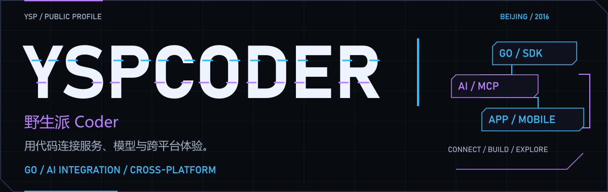
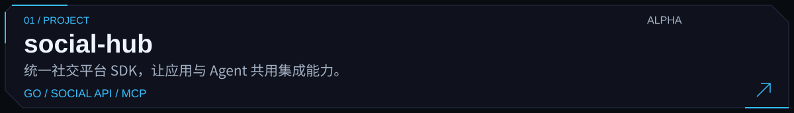
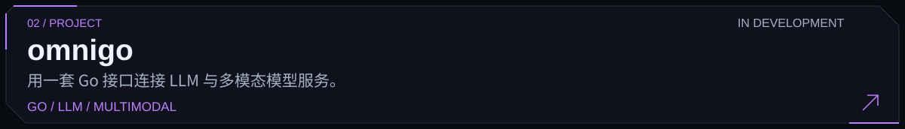
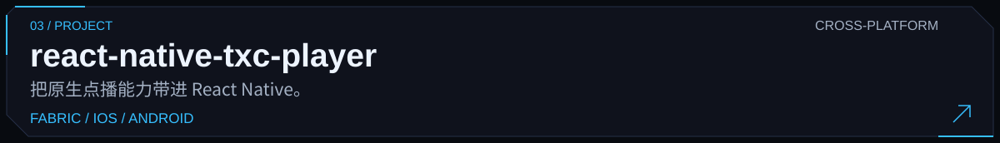
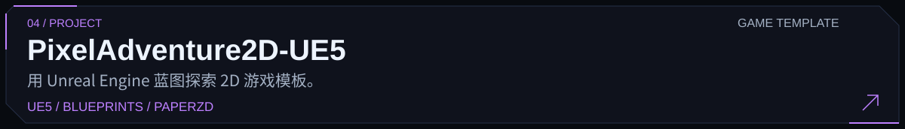
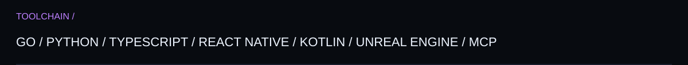

<picture>
  <source media="(max-width: 640px)" srcset="assets/cyber-cover-mobile.png">
  
</picture>

  <a href="#精选项目">项目</a> ·
  <a href="#技术方向">技术</a> ·
  <a href="#开源足迹">数据</a> ·
  <a href="https://github.com/YspCoder?tab=repositories">仓库</a>

## 精选项目

<a href="https://github.com/YspCoder/social-hub">
  <picture>
    <source media="(max-width: 640px)" srcset="assets/cyber-project-social-hub-mobile.svg">
    
  </picture>
</a>

<a href="https://github.com/YspCoder/omnigo">
  <picture>
    <source media="(max-width: 640px)" srcset="assets/cyber-project-omnigo-mobile.svg">
    
  </picture>
</a>

<a href="https://github.com/YspCoder/react-native-txc-player">
  <picture>
    <source media="(max-width: 640px)" srcset="assets/cyber-project-react-native-txc-player-mobile.svg">
    
  </picture>
</a>

<a href="https://github.com/YspCoder/PixelAdventure2D-UE5">
  <picture>
    <source media="(max-width: 640px)" srcset="assets/cyber-project-pixel-adventure-mobile.svg">
    
  </picture>
</a>

[social-hub 文档](https://github.com/YspCoder/social-hub/blob/main/README.zh-CN.md) · [omnigo 示例](https://github.com/YspCoder/omnigo#快速开始) · [播放器接入](https://github.com/YspCoder/react-native-txc-player#usage)

## 技术方向

<picture>
  <source media="(max-width: 640px)" srcset="assets/cyber-stack-mobile.svg">
  
</picture>

也在整理 [gemini-image-proxy](https://github.com/YspCoder/gemini-image-proxy) 与 [clawgo-skills](https://github.com/YspCoder/clawgo-skills)，让重复的工作更容易交给工具。

## 开源足迹

<picture>
  <source media="(prefers-color-scheme: dark) and (max-width: 640px)" srcset="assets/stats-mobile-dark.svg">
  <source media="(max-width: 640px)" srcset="assets/stats-mobile-light.svg">
  <source media="(prefers-color-scheme: dark)" srcset="assets/stats-dark.svg">
  
</picture>

---

  <a href="https://github.com/YspCoder?tab=repositories">探索仓库</a> ·
  <a href="https://github.com/YspCoder/social-hub/issues">交流想法</a>

